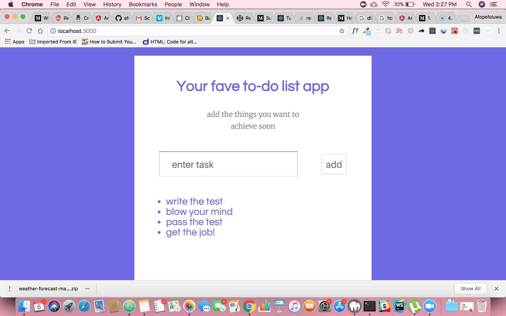

# to do app
this application is a to do app built in react for the nadep job tech test!

## installation
* this program was written in reactjs
* use a terminal
* run this command to install dependencies `npm install`

### cloning the code
* to copy the project on your computer, open your terminal and do this: [git clone](https://github.com/afope/to-do-app-react.git) e.g $ `git clone <remote repo> <repo name>`
* you will find the **remote repo** link above by clicking on the green *"clone or download"* option in tab above the repository
* then run `cd <repo name>` in your terminal (*<repo name>* is whatever name you gave your repository in the terminal)
* this should open up the folder you just cloned from github
* open up your code editor

## usage
### running the code

to run the code run the following commands in your terminal:
* after you download the code, run `yarn start` in your terminal

## contribution
you can try to implement the to do app yourself. i didn't have time to work on the edit and delete function but you can tots do that! and let me see what you come up with

## licensing
this code follows the [mit license](https://github.com/angular/angular.js/blob/master/LICENSE)
